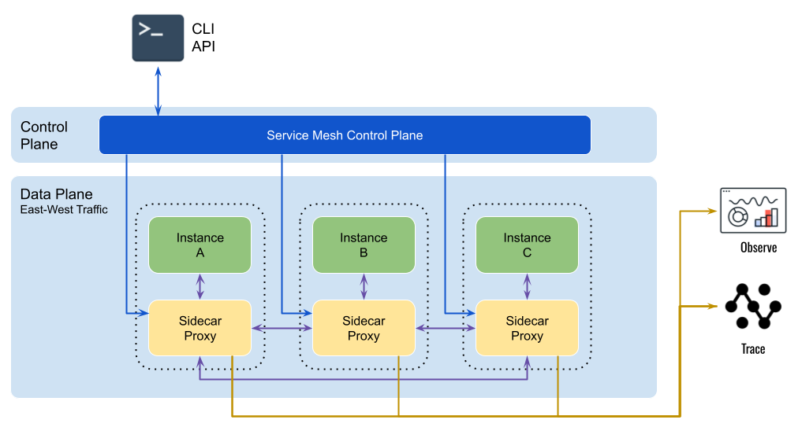

# Service Mesh

- 분산된 애플리케이션에서 서비스간 통신을 관리하는데 도움을 주는 네트워크 인프라 계층
- 트래픽 관리, 서비스 검색, 로드밸런싱, 보안 등에 도움이 되는 서비스 제공
- 실질적으로는 Proxy와 동일하며, Sidecar pattern 방식으로 배치되기 때문에 Sidecar Proxy라고 부른다
- Istio, Linkerd, Consul, Envoy, Traefix Mesh, Nginx Service Mesh 등 다양한 서비스 애플리케이션이 있다.

### 구성요소

- Sidecar Proxy

  - Sidecar Proxy는 단일 인스턴스 혹은 POD와 함께 실행됨
  - Sidecar Proxy의 목적은 함께 실행되는 컨테이너로 트래픽을 라우팅 또는 프록시
  - Sidecar Proxy는 다른 Sidecar Proxy와 통신하며, Service Mesh Control Plane에 의해서 관리

- Service Discovery

  - 인스턴스가 다른 서비스와 통신해야 하는 경우 사용가능한 서비스 인스턴스를 찾아야 함.
  - 일반적으로는 DNS 조회를 수행하는데, 컨테이너 오케스트레이션 시스템(Kubernetes 등)은 작동중인 인스턴스의 목록과 인스턴스의 DNS 이름을 제공한다.
  - 이 구조에서는 Service Mesh가 Service Discovery 대체

- 인증 및 승인: Service Mesh는 내부/외부 요청을 승인하고 인증하여 검증된 요청만 인스턴스로 보낼 수 있음.

- Circuit breaker pattern 제공

  - Circuit breaker pattern: 비정상 인스턴스를 격리하고, 정상적으로 작동하는 인스턴스 풀로 다시 가져옴

- 암호화: Service Mesh는 요청과 응답을 대신 암호화 및 복호화 해서 서비스의 부담을 제거한다.

### Service Mesh - Istio

> Kubernetes에서 실행되는 마이크로서비스 기반 애플리케이션의 연결, 보안, 관리, 제어, 모니터링 솔루션을 제공하는 오픈소스 Service Mesh 플랫폼

- Service resilience

  - 서비스 탄력성을 개선하는 메커니즘을 제공
  - 여기에는 서킷 브레이커(circuit breakers), 타임아웃, 재시도와 같은 기능이 포함되어 오류가 확산되는 걸 방지하고 서비스 종속성을 관리하는데 도움

- Policy enforcement

  - 속도제한(Rate limiting), 접근 제어(Access control), 요청 할당량 같은 네트워크 수준에서의 정책을 정의하고 적용
  - 이러한 정책을 이용해서 마이크로서비스 아키텍처 전반의 보안 및 규정 준수 요구사항 관리

- Traffic management

  - 지능형 트래픽 라우팅과 로드 밸런싱 기능을 제공한다
  - 백분율 기반 트래픽 분할, A/B 테스트, 카나리아 배포와 같은 다양한 라우팅 규칙을 적용하여 서비스간 네트워크 트래픽 흐름을 제어

- Security: TLS(Transport Layer Security)인증을 제공하여 서비스간 인증과 암호화 데이터 통신을 지원한다. 또한 세분화된 엑세스 제어 및 권한등을 통해서 서비스를 보호할 수 있다.

- Observability: Istio는 분산 추적, 모니터링을 위한 메트릭 수집 등 강력한 관찰 가능성 기능을 제공한다. Jaeger, Prometheus, Grafana와 같은 모니터링 툴과 통합되어서 서비스의 성능, 상태에 대한 중요 정보들을 얻을 수 있다.

public.n3r.reg.navercorp.com/n3r/ingress-nginx/controller:
